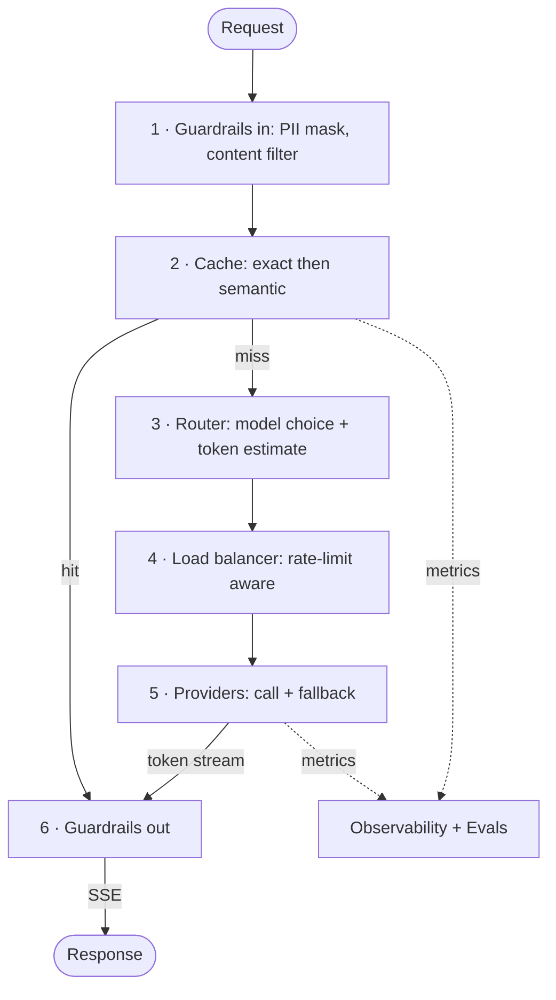

<div align="center">

```
 _      _     ___  ___    _____   ___ _____ _____ _    _  _____   __
| |    | |    |  \/  |   |  __ \ / _ \_   _|  ___| |  | |/ _ \ \ / /
| |    | |    | .  . |   | |  \// /_\ \| | | |__ | |  | / /_\ \ V / 
| |    | |    | |\/| |   | | __ |  _  || | |  __|| |/\| |  _  |\ /  
| |____| |____| |  | |   | |_\ \| | | || | | |___\  /\  / | | || |  
\_____/\_____/\_|  |_/    \____/\_| |_/\_/ \____/ \/  \/\_| |_/\_/  
                                                                  
```

**Semantic caching that knows when it would be lying to you.**


### `cache-hit cost −X%` *(measuring)*

</div>

> I built a semantic cache for my LLM gateway to measure the real cost delta, and found the one query pattern where it confidently lied to users.

---

## What this is

An LLM gateway I'm building by hand, to learn llm production engineering the hard way and to answer one question I actually care about: how much money and latency can semantic caching save before it starts lying to people?

It's a real FastAPI service... Pydantic validation, streaming (SSE) responses and a full request pipeline: guardrails, cache, smart routing, load balancing, fallback, observability. It all runs in containers, and one command brings it up.

I'm not building another LiteLLM or Portkey. Wiring a proxy to a provider is a weekend and a pip install away, and it teaches you nothing. I wanted the version that hurts (no pain, no gain). What I care about is the internals: the cache, the safety checks, the router, the queue, the benchmark. I bought only the things it would be dumb to reinvent, like the web framework, the driver, and the database... like, I can write a loop over a socket, I just don't feel the need to prove it by rewriting Postgres, which is 30 years of other people's pain and works fine IKWIM.

The cache is the piece I measure in depth, because that's where it gets fun: cosine similarity is a vibe, not a proof. Similarity is not correctness, and I wanted to catch the exact moment the cache confuses the two.

> How much cost and latency can semantic caching remove before similarity starts compromising correctness?

- I built the whole pipeline: guardrails, cache, routing, load balancing, fallback, and observability.
- Responses stream token by token (SSE), which is where the ugly questions live: how do you cache, cost-account, and filter a stream that isn't finished yet? Carefully, and with trust issues.
- The cache is the experiment. I do not treat a similarity score as a correctness boundary. Every hit has to clear deterministic safeguards before I serve it.
- Shadow mode measures what the cache *would have* returned, without inflicting a wrong answer on a real user.
- Governance is built in: centralized keys, per-tenant quotas, and a versioned prompt registry.
- Every decision is explainable: which stage fired, the similarity score, and the cost I saved.

## How it works

Every request walks a pipeline of stages. The cache is the one I obsess over; the rest is the production context that makes the cache's job realistic.



Cross-cutting: centralized keys, per-tenant quotas, a versioned prompt registry, and a human-in-the-loop queue for outputs I don't trust. Responses stream back token by token (SSE), which is exactly what makes stages 2 and 6 painful: caching and output-filtering a stream mid-flight. Full stage-by-stage breakdown in [docs/architecture/request-pipeline.md](docs/architecture/request-pipeline.md). The service topology is in [docs/architecture/](docs/architecture/).

## Results

No numbers yet, and I won't fake them. Every cell fills in from a reproducible benchmark or it stays `TBD`. Estimates are just lying with extra steps, and if a number isn't reproducible from a clean clone, it's marketing. I don't do marketing.

| Scenario | Provider calls | False hits | P95 | Est. cost |
|---|---|---|---|---|
| No cache | TBD | 0% | TBD | TBD |
| Exact cache | TBD | 0% | TBD | TBD |
| Protected semantic cache | TBD | TBD | TBD | TBD |

## Quickstart

```bash
./run.sh      # UNIX
run.bat       # Windows in case you are not a real nerd
```

You need **Docker**, **Docker Compose**, and a shell. Nothing else touches your machine. If running a project takes a three-page setup guide, the project already failed. That is the whole point of shipping it in containers.

## Architecture

Nine containers: four of them contain code I actually wrote, while the others are services that someone else already built and shared as opensourcelly. I split the services based on actual differences in scalability or resource requirements, not because some Java folks think microservices looks cool!

- **gateway**: the I/O-bound edge (auth, validation, routing, cost accounting).
- **cache**: exact and semantic lookup, vector search, safety analysis. CPU-bound, and it scales on its own clock.
- **embeddings**: heavy models sitting in memory, isolated so it can hog its own hardware.
- **worker**: an asyncio loop draining my handmade job queue for storing, shadow comparison, and cache warming, all off the request path.

Backed by PostgreSQL with pgvector and Redis, with a correlation ID stitched through the structured logs and surfaced in Prometheus and Grafana. Providers stay inside the gateway on purpose: their circuit-breaker and fallback state lives on the request hot path, so pulling them into their own service would buy me a network hop and nothing else. I justify every split in [ADR-009](docs/decisions/README.md), and what I built versus bought in [ADR-011](docs/decisions/README.md). More in [docs/architecture/](docs/architecture/).

## Built by fire and blood

The interesting parts are mine. The boring, solved parts are not. Reinventing a database driver to look smart is how you achieve the opposite. Building a cache that lies to users and then catching it red-handed is the part actually worth reading.

| Built by hand | Bought |
|---|---|
| Semantic cache and safety checks | FastAPI, Uvicorn, Pydantic |
| Provider adapters (no LiteLLM) | asyncpg, Redis |
| Router, guardrails, cost accounting | Prometheus, Grafana |
| Job queue | PostgreSQL, pgvector |
| SQL migrations, benchmark, correlation-ID tracing | sentence-transformers |

Full reasoning in [ADR-011](docs/decisions/README.md).

## Roadmap

- ✅ Figured out what I'm building and the standard I'm holding it to
- 🚧 Phase 1 · Gateway foundation: FastAPI service, provider adapter, SSE streaming, request validation, Docker Compose
- ⬜ Phase 2 · Exact caching: Redis, request normalization, stampede protection
- ⬜ Phase 3 · Semantic caching: pgvector, embeddings service, handmade job queue, shadow mode
- ⬜ Phase 4 · Cache safety: negation, number, entity and tenant safeguards, false-hit rate
- ⬜ Phase 5 · Production capabilities: routing, resilience, rate limiting, correlation-ID tracing, dashboards
- ⬜ Phase 6 · Engineering report: benchmark methodology, measured deltas, lessons learned

## Documentation

I write the docs as I go, not as an afterthought. Here is where things live:

| Area | Where |
|---|---|
| Architecture | [docs/architecture/](docs/architecture/) |
| Decisions (ADRs) | [docs/decisions/](docs/decisions/) |
| Development | [docs/development/](docs/development/) |
| Operations | [docs/operations/](docs/operations/) |
| Security | [docs/security/](docs/security/) |
| Experiments | [docs/experiments/](docs/experiments/) |
| Benchmarks | [docs/benchmarks/](docs/benchmarks/) |

## Status

```text
Stage:              Foundation
Production ready:    No (experimental)
Cache-hit cost:      Not yet measured
False-hit rate:      Not yet measured
```

---

<div align="center">

Apache 2.0 · Built by [Rodrigo Marques Dantas](https://github.com/napalm23zero) · Built in public

</div>
