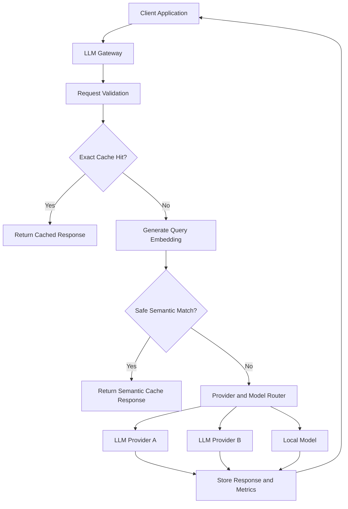
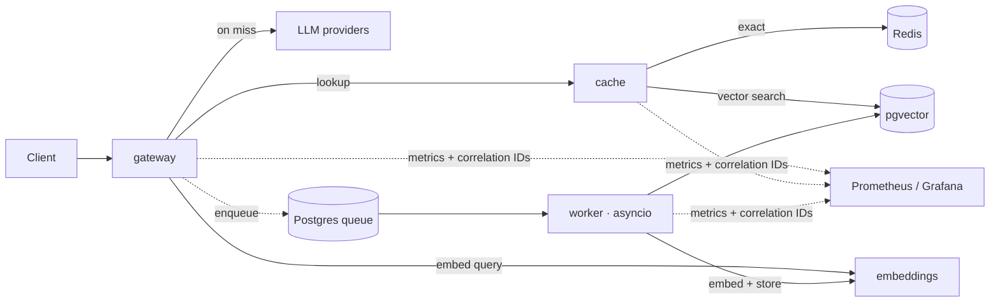

# Architecture

How a request moves through the gateway, and how the platform splits into services. Go deeper: [request-pipeline.md](./request-pipeline.md) for the stages, [semantic-cache-safety.md](./semantic-cache-safety.md) for the part that actually matters.

## The core decision

A request comes in and the gateway picks one of six moves:

1. Serve an exact cached response
2. Serve a safe semantic match
3. Call a provider
4. Reject it (unsafe or invalid)
5. Route it to a different model or provider
6. Fall back when a provider is down



## Service topology

A handful of independently deployable services. I split only where there's a real difference in scale or resource profile. No service exists just to look like a microservices diagram (rationale: ADR-009).



| Service | Job | Why it's its own service |
|---|---|---|
| gateway | The edge: auth, tenant isolation, validation (Pydantic), rate limiting, normalization, routing, retries, fallback, cost accounting. Hosts the provider adapters. | I/O-bound and public. Scales with request volume, stays light on the hot path. |
| cache | Exact + semantic lookup, vector search, safety checks. Owns the "can I reuse this?" call. | Vector search and safety are CPU-bound and change on their own schedule. Tune them without redeploying the edge. |
| embeddings | Turns text into vectors behind a stable interface. | CPU/GPU-bound, heavy models hogging RAM. The diva of the stack: totally different hardware profile, so it gets its own (maybe GPU) nodes. |
| worker | asyncio loop draining a Postgres job queue: store embeddings, shadow comparison, cache warming. | Background by nature. Keeps slow, non-urgent work off the request path. |

Supporting infra, not app services: **PostgreSQL** (pgvector for embeddings plus a table that backs the queue), **Redis** (exact cache and single-flight locks), **Prometheus + Grafana** (fed by metrics and correlation IDs from the logs). Provider adapters stay *inside* the gateway: their circuit-breaker and fallback state is on the hot path, so splitting them out buys a network hop and nothing else (ADR-009).

## Stack

Might shift as I build. I care about clean boundaries more than framework flexing.

| Area | Choice |
|---|---|
| Gateway API | Python + FastAPI |
| Async | asyncio |
| Background work | asyncio worker on a Postgres queue (`SKIP LOCKED`) |
| Database | PostgreSQL |
| Vectors | PostgreSQL + pgvector |
| Data access | SQL over asyncpg, no ORM |
| Migrations | Versioned `.sql` + a runner, no Alembic |
| Exact cache | Redis |
| Embeddings | Local or external, configurable |
| Providers | Handmade adapter interface |
| Streaming | Server-Sent Events |
| Resilience | Circuit breaker + retry (tenacity) |
| Metrics | prometheus-client + Prometheus |
| Dashboards | Grafana |
| Tracing | Correlation IDs in structured logs, handmade |
| Load testing | Handmade, asyncio + httpx |
| Containers | Docker + Compose |
| CI | GitHub Actions |

## Cache modes

| Mode | Behavior |
|---|---|
| disabled | Always calls the provider |
| exact | Reuses only identical normalized requests |
| semantic | Allows validated semantic matches |
| read-only | Reads the cache, never writes |
| write-only | Writes eligible responses, never serves hits |
| shadow | Evaluates would-be hits without serving them |

**Shadow mode** is how I tune the semantic cache without risking anyone: the gateway still serves the fresh provider answer but records whether the semantic cache *would* have hit, and the worker compares the two offline. I get the data, nobody eats a wrong cached answer.

## Provider routing

Clients talk to logical profiles, not raw provider model names:

```yaml
modelProfiles:
  gateway-fast:
    strategy: lowest-latency
    providers:
      - provider-a/small-model
      - local/small-model
  gateway-balanced:
    strategy: weighted
    providers:
      - provider-a/medium-model
      - provider-b/medium-model
  gateway-premium:
    strategy: quality-first
    providers:
      - provider-a/large-model
      - provider-b/large-model
```

- **Smart routing:** model choice is a decision, not a constant. Sending "fix this typo" to a frontier model is how you set money on fire. Trivial task, small cheap model; hard prompt, the heavy one. Spend the fewest tokens that still clear the quality bar.
- **Token guard:** estimate tokens before sending, to feed cost accounting and catch an oversized prompt before it hits a "context window exceeded" error.
- **Load balancing:** spread across providers and accounts to stay under rate limits. Load balancing dodges the limit, fallback reacts when an upstream dies anyway.

## Cache stampede

100 identical requests landing at once shouldn't become 100 provider calls and one very expensive invoice. A short-lived lock / single-flight makes the thundering herd wait on one call:

```text
100 concurrent identical requests
              ↓
       1 provider request
              ↓
    100 shared responses
```

## Repository layout

Names describe responsibility, not tech. I don't create an empty directory just so the tree looks impressive; it shows up when it has a job.

```text
llm-gateway/
├── .devcontainer/        # dev container: workspace image + host Docker socket access
├── .docker/              # compose aggregator (include:) + environment overlays
│   ├── docker-compose.yml       # base: includes each service's .docker compose
│   ├── docker-compose.dev.yml   # dev overlay: reload, bind mounts, published ports
│   └── docker-compose.test.yml  # test overlay: run suites in-container
├── .github/
├── services/
│   ├── gateway/          # edge: auth, validation, routing, cost, provider adapters
│   │   ├── .docker/      # this service's Dockerfile + production-shaped base compose
│   │   └── app/
│   ├── cache/            # exact + semantic cache, vector search, safety analysis
│   ├── embeddings/       # embedding generation (CPU/GPU-bound)
│   └── worker/           # asyncio background: store, shadow, warming
├── database/             # migrations and schema (PostgreSQL + pgvector)
├── monitoring/           # Prometheus and Grafana dashboards
├── benchmarks/           # reproducible workloads and the benchmark suite
├── infrastructure/       # shared networks, health checks, deploy manifests
├── scripts/
├── docs/
├── tests/
├── run.sh
├── run.bat
├── README.md
├── LICENSE
└── CONTRIBUTING.md
```

Docker composition is co-located per service, not centralized: each service owns its `.docker/`, and `.docker/docker-compose.yml` aggregates them with Compose `include:`. Environment differences are `-f` overlays, never baked in (ADR-013).
