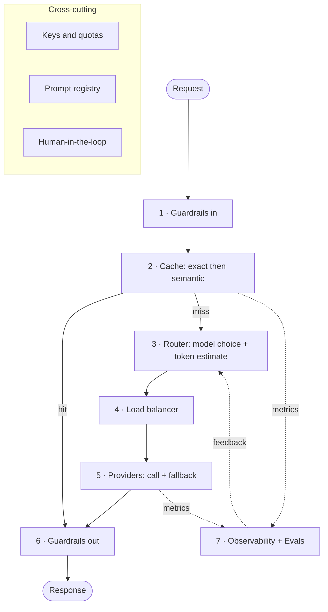

# Request Pipeline

Every request runs through ordered stages before and after it hits a provider. This is the map. The cache (stage 2) is the one I measure in depth: [semantic-cache-safety.md](./semantic-cache-safety.md). How stages map onto services: [README.md](./README.md).

All planned, nothing measured yet, and I'll keep saying so until it is.

## Stages

**1. Guardrails (in).** Mask PII and flag unsafe content before your prompt goes to live on someone else's GPU. Detail in [../security/README.md](../security/README.md).

**2. Cache.** Exact lookup first (cheap and safe), then semantic lookup behind the safety checks. A hit skips the provider entirely. This is the experiment: how much can semantic caching save before similarity wrecks correctness. See [semantic-cache-safety.md](./semantic-cache-safety.md).

**3. Router.** On a miss, the router picks the model instead of hard-coding one ("summarize this" does not need a frontier model with a PhD) and estimates tokens before sending. Signals in [README.md](./README.md).

**4. Load balancer.** Spreads requests across providers and accounts to stay under rate limits.

**5. Providers and fallback.** Calls the chosen provider through a stable adapter. A circuit breaker and retry protect the hot path; when a provider is down, slow, or throttled, an automatic fallback reroutes to a comparable model so nobody eats a raw error.

**6. Guardrails (out).** Content checks and redaction on the way out. Detail in [../security/README.md](../security/README.md).

**7. Observability and evals.** Every stage emits metrics and a correlation ID that stitches one request across services (handmade tracing, no external collector). The data also feeds continuous evals. Detail in [../operations/README.md](../operations/README.md) and [../experiments/README.md](../experiments/README.md).

## Streaming

Responses stream token by token (SSE), so in-path stages work on a stream, not a finished value:

- **Cache** (stage 2) stores only after the stream finishes cleanly. Disconnect mid-stream, nothing gets stored. No partial entries, ever.
- **Output guardrails** (stage 6) filter as the stream flows. Buffering first would defeat the point.
- **Cost accounting** counts tokens as they land, records the total on close.

That's ADR-012.

## Cross-cutting

Not stages, they apply everywhere.

- **Keys and quotas.** One master key at the gateway, per-tenant quotas to cap spend. It's a security control, so the detail is in [../security/README.md](../security/README.md).
- **Prompt registry.** Callers send a template id (say `translation_task_v2`); the gateway stores the instructions and resolves it, so a prompt can change without a redeploy. Ties into ADR-008.
- **Human-in-the-loop.** Low-confidence outputs get flagged into a review queue for a human before the user sees them, and the corrections become training data. Detail in [../experiments/README.md](../experiments/README.md).

## Where stages live

Stages are modules inside the existing services, not new services. A stage becomes its own service only when a measurement proves it needs independent scale, same rule as ADR-009. See ADR-010.
