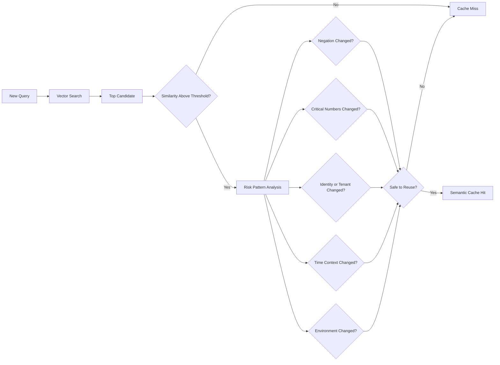

# Semantic Cache Safety

Why a high similarity score is not proof that two requests can share an answer, and how the gateway rejects the unsafe ones. Cosine similarity is a vibe, not a proof. This is the correctness core of the whole project. Overview: [README.md](./README.md).

## Two rules

- **Similarity is not correctness.** A score is never proof that two requests are interchangeable. Negation, numbers, dates, currency, entities, user, tenant, environment, permissions, prompt version, model version, tool state, freshness: any of them can flip the meaning while the vectors barely move.
- **Sensitive stuff bypasses the semantic cache by default.** Auth, finance, medical, legal, private data, real-time state, destructive or side-effecting operations, production commands: they skip it entirely.

Both boil down to one thing: **prefer a miss over an unsafe hit.** A miss costs one provider call. An unsafe hit returns a confidently wrong answer, which is way more expensive.

## Where a semantic cache lies

The trap is two requests that are structurally near-identical but differ in one meaning-changing token. To an embedding model, `$10` and `$10,000` are practically neighbors. To your bank account, they are not. Each pair below is close in embedding space and opposite (or materially different) in meaning:

### Negation
```text
Enable account deletion.
Disable account deletion.
```

### Time-sensitive
```text
What is the current deployment status?
What was the deployment status yesterday?
```

### Identity
```text
Show my latest invoice.
Show Maria's latest invoice.
```

### Numbers
```text
Transfer $10.
Transfer $10,000.
```

### Environment
```text
Delete the test database.
Delete the production database.
```

### Permissions
```text
Can an administrator export all users?
Can a regular user export all users?
```

A high score guarantees nothing. That's exactly why the cache never uses a similarity threshold as its only decision.

## The safety strategy

A semantic result has to clear multiple checks before I serve it. The threshold only decides whether a candidate is worth analyzing. Everything after it is risk analysis.



Any single failing check means a miss. The checks are conjunctive: I reuse only when *every* safeguard agrees.

### Planned safeguards

* Minimum similarity threshold
* Maximum semantic distance
* Exact tenant and namespace match
* Prompt-template version match
* Model and system-prompt match
* Negation detection
* Number and currency comparison
* Date and time-context comparison
* Named-entity comparison
* Environment keyword protection
* Sensitive-request exclusion
* Per-endpoint cache policies
* Maximum cache age
* Human-reviewed adversarial test cases
* Optional secondary-model validation for ambiguous matches

Sensitive-request exclusion enforces rule two: those requests never reach the reuse decision, no matter how high the score. Full exclusion list in [../security/README.md](../security/README.md).
